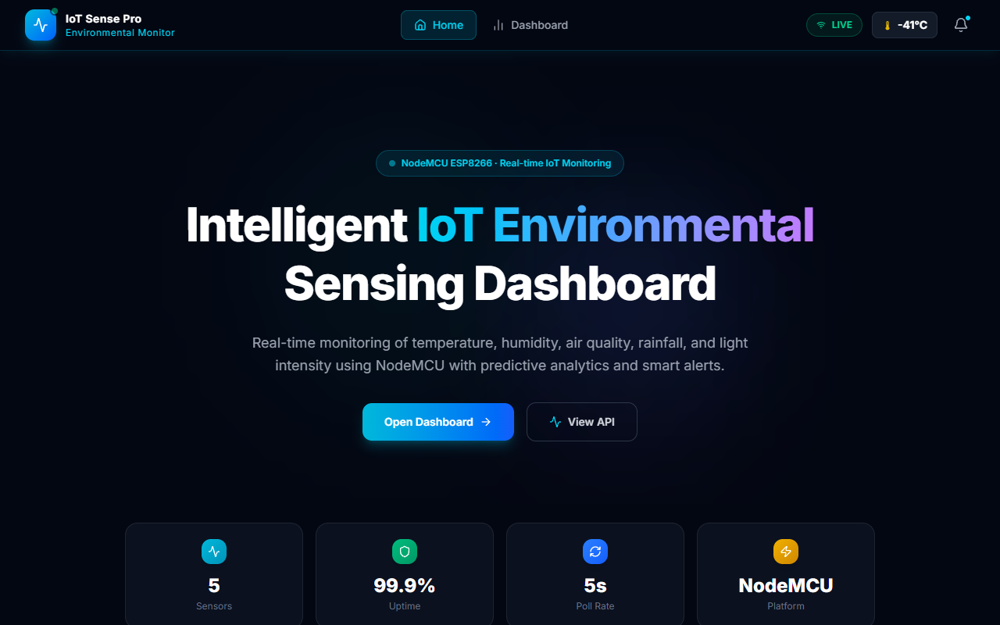

# IoT Sensor Dashboard with ML Prediction

This project is a comprehensive IoT solution that collects real-time sensor data, processes it through a Node.js backend using a TensorFlow.js LSTM model for predictive analytics, and visualizes the data on a React-based frontend dashboard. 

The system tracks Temperature, Humidity, Air Quality, Rainfall, and Light Level (LDR), providing real-time forecasting and "time-to-danger" alerts.

## Project Structure

- **`backend/`**: Node.js & Express server.
  - Handles API requests and real-time WebSocket (`Socket.io`) connections.
  - Integrates with MongoDB (`mongoose`) to store historical sensor data.
  - Uses TensorFlow.js (`@tensorflow/tfjs`) for an LSTM model that trains on historical data and predicts future sensor values (Trends & Time-to-danger).
- **`client/`**: React & Vite frontend application.
  - Displays real-time sensor metrics using `Recharts`.
  - Styled with TailwindCSS.
  - Receives live data and ML predictions via `Socket.io-client`.
- **`arduino_firmware/`**: Firmware for the IoT hardware device responsible for capturing physical sensor readings and transmitting them.

## Tech Stack

### Backend
- **Runtime:** Node.js
- **Framework:** Express.js
- **Database:** MongoDB (via Mongoose)
- **Real-time:** Socket.io
- **Machine Learning:** TensorFlow.js (`@tensorflow/tfjs` - LSTM Sequential Model)

### Frontend
- **Framework:** React 19 (via Vite)
- **Styling:** TailwindCSS 4
- **Real-time:** Socket.io-client
- **Charting:** Recharts
- **Icons:** Lucide React

---

## 🚀 Getting Started

Follow these instructions to set up the project locally.

### Prerequisites
- [Node.js](https://nodejs.org/) (v16 or higher recommended)
- [MongoDB](https://www.mongodb.com/try/download/community) (Running locally or a MongoDB Atlas URI)

### 1. Setup the Backend

1. Navigate to the backend directory:
   ```bash
   cd backend
   ```
2. Install dependencies:
   ```bash
   npm install
   ```
3. Environment Setup:
   - Ensure the `.env` file exists and contains the required environment variables:
     ```env
     PORT=5000
     MONGO_URI=your_mongodb_connection_string
     ```
4. Start the backend development server:
   ```bash
   npm run dev
   ```
   *The server will start on `http://localhost:5000` (or your configured port) and the ML model will initialize with historical data.*

### 2. Setup the Frontend (Client)

1. Open a new terminal and navigate to the client directory:
   ```bash
   cd client
   ```
2. Install dependencies:
   ```bash
   npm install
   ```
3. Start the Vite development server:
   ```bash
   npm run dev
   ```
   *The application will be accessible at `http://localhost:5173`. It will automatically connect to the backend WebSocket.*

## Dashboard Snapshot



### 3. Arduino Firmware (`esp32_firmware`)

The ESP32 microcontroller collects data from attached sensors (DHT11, MQ135, Rain Sensor, LDR) and sends it over Wi-Fi via a POST request to the backend API (`/api/sensor`).

**Hardware Connections (ESP32):**
- **DHT11 (Temp/Humidity):** Data Pin -> GPIO 4
- **MQ135 (Air Quality):** Analog Pin -> GPIO 34
- **Rain Sensor:** Analog Pin -> GPIO 35
- **LDR (Light):** Analog Pin -> GPIO 32
- **Buzzer:** Positive -> GPIO 26
- **LED Alert:** Positive -> GPIO 27

**Setup Instructions:**
1. Open up the Arduino IDE.
2. Go to `Tools > Board` and select your ESP32 board model.
3. Open the firmware source code located at `esp32_firmware/esp32_firmware.ino`.
4. Install the required libraries in Arduino IDE:
   - `DHT sensor library` by Adafruit
   - `WiFi.h` and `HTTPClient.h` (included in ESP32 board package)
5. Update the Wi-Fi credentials in the script:
   ```cpp
   const char* ssid = "YOUR_WIFI_SSID";
   const char* password = "YOUR_WIFI_PASSWORD";
   ```
6. Update the `serverName` to point to the backend's local network IP address (e.g., `http://192.168.1.xxx:5000/api/sensor`).
7. Connect your ESP32 via USB and click **Upload**.
8. Once uploaded, open the Serial Monitor (`115200` baud) to verify Wi-Fi connection and sensor readings.

---

## Developer Notes
- **Machine Learning**: The LSTM predictor in `backend/ml/SensorPredictor.js` uses a sliding window (10 timesteps) of historical readings to predict future states. It automatically retrains itself on the fly as new data streams in (every 5 readings).
- **WebSockets**: Real-time communication is facilitated by Socket.io. The backend broadcasts `sensor:prediction` events to all connected clients containing both the current readings, computed trends, time-to-danger metrics, and ML prediction confidence.
- **Status Thresholds**: Sensor warning/danger thresholds are centrally defined in the backend and use predictions to alert the UI ahead of time.
